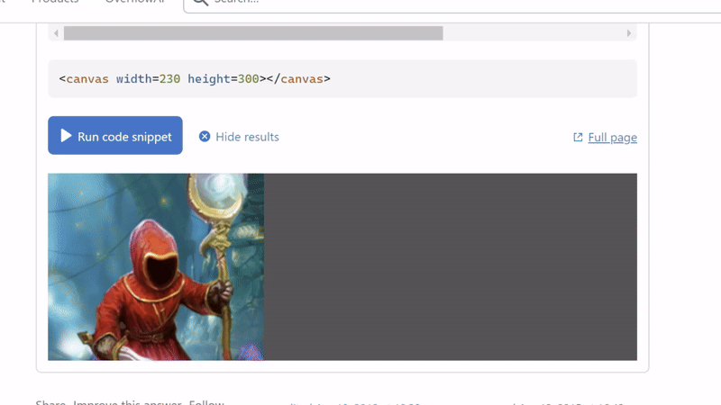

# 9103 - Wk08 Quiz 
#### Gillian Xie (gxie0205)

## Part 1: Imaging Technique Inspiration
### Creating a landscape using grainy/particle effects
-	Gao Yang (Particle) creates stunning mountain landscapes using a grainy, particle effect. Colours are striking and rich and the effect gives the illusion of flowing sand.
-	I believe such a technique would be interesting to apply to Monet or Munch or Kooning’s piece from the assignment through creating animated movement, such as flowing water (Monet), or the feeling of movement in the background (Much and Kooning). I believe Munch’s work especially lends itself well to this technique due to the style of brush stroke.
-	It would also be interesting to experiment with saturated colours.

[Source - Excerpt from Chapter 1 *The Faults 断层 by Gao Yang (Particle)*](https://www.behance.net/gallery/122945363/The-Faults-/modules/699368993)

[Source - Excerpt from *The Faults 断层 by Gao Yang (Particle)*](https://www.behance.net/gallery/122945363/The-Faults-/modules/699368997)

## Part 2: Coding Technique Exploration
### Oscillator objects and SVG noise filters with CSS gradients
-	An oscillator object can be used to distort an image, creating a wavy effect. This could be used to achieve the mountain-like effects from Part 1 through application to an image containing blocks of colour.

[Source - Excerpt from *Oscillators and displacement* by user1693593 (Link to Code)](https://stackoverflow.com/questions/29586754/how-can-i-recreate-this-wavy-image-effect)

-	SVG noise can be used on top of CSS gradients to expand usage of noise outside of solid blocks of colour. This could then be applied on top of the above object (with the addition of some gradients) to create the sand-like, grainy effect. 

[Source - Excerpt from *Grainy Gradients* by Jimmy Chion (Link to Code)](https://css-tricks.com/grainy-gradients/)
